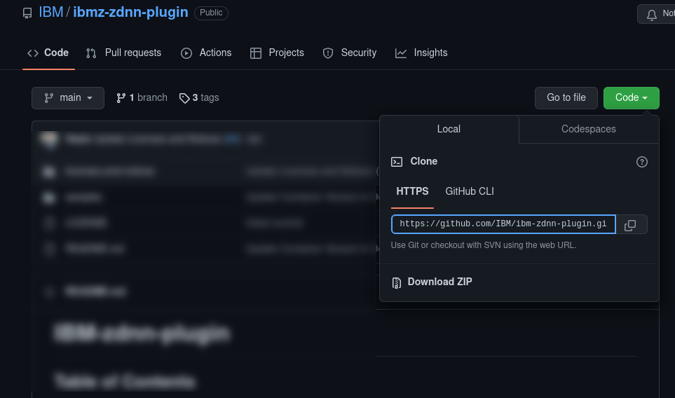

# Download and Setup Instructions

There are a few ways you can download the samples to run with ibm-zdnn-plugin. You can clone this repository with an installed [git](https://git-scm.com) client, download it as a zip, or download individual files using the Github web interface. With a git client you can clone this repository directly onto an IBM Z&reg; system if your local policies allow Internet access.

You might already be familiar with these techniques. These instructions are the same for any Github repository.

## Download Files

Choose one of the following options.

### Option 1. Clone the Entire Repository

This option will give you access to the samples, but will download additional files (e.g this document) that you might not need. Running the `git pull` command will download updates that are later made to the repository.

A git client must be installed on your workstation or on an IBM Z system, with Internet access to github.com.

From the [home page](https://github.com/IBM/ibm-zdnn-plugin) for this repository you can click the green 'Code' drop down button to show and copy the git clone uri for the repository. Add this uri to a `git clone` command to clone the repository into your current directory.

If the `git clone` was performed on your workstation, copy the files to the IBM&reg; Z system where you will run the container. Use scp, ftps or any file transfer solution available in your installation.

### Option 2. Download the Entire Repository

This option will give you access to the samples, but will download additional files you might not need. To get updates from the repository, repeat these instructions.

From the [home page](https://github.com/IBM/ibm-zdnn-plugin) for this repository you can click the green 'Code' drop down button. Click the 'Download ZIP' button to download the repository as a zip file.

Extract the zip file either on your workstation and copy the samples to the IBM Z system where you will run the container. Use scp, ftps or any file transfer solution available in your installation.

### Option 3. Download Sample Files Individually

This option will give you access to the samples and not download extraneous files. However, each file must be downloaded individually. To get updates from the repository, repeat these instructions.

Go to the sample file in the Github web interface and download it with one of the following:

- Click the 'Raw' button to view the contents of the file only. Then either:
  - Right click and select 'Save Page As...' (might be different in your web browser) to save the sample to  your workstation.
  - Select the entire contents of the file, copy it, and then past the content to a file editor on your workstation.
- Right click the 'Raw' button in the github web interface and select 'Save Link As..'  (might be different in your web browser) to download the content as a file.

# Training on CPU

Some of the samples, or your own TensorFlow applications, will train models. IBM-zDNN-Plugin supports inferencing workloads only. Training workloads should be performed with a base Tensorflow build, or with IBM-zDNN-Plugin removed from the software installation or disabled as described in [Modifying Default Execution Paths](../README.md#modifying-default-execution-paths).

# Running the Samples

See the README.md file included with the sample for additional setup instructions and for the commands to run them.

Currently there is one sample available:

[Fashion MNIST](fashion-mnist)
